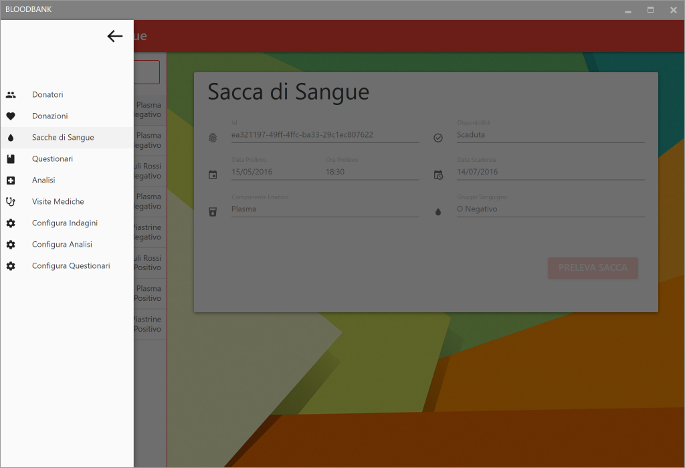
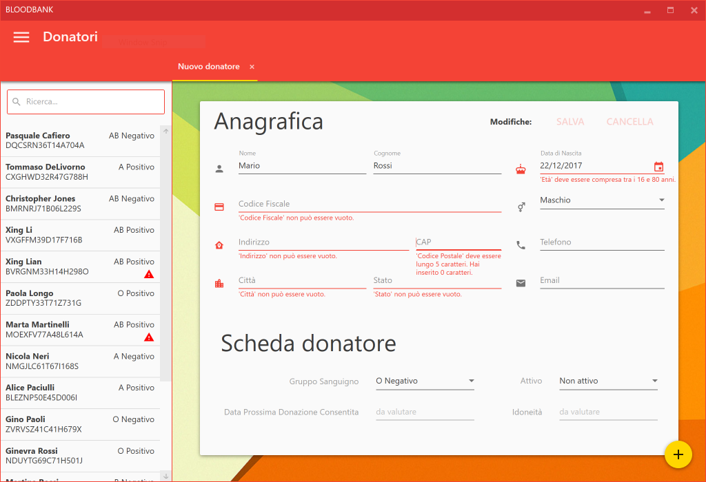
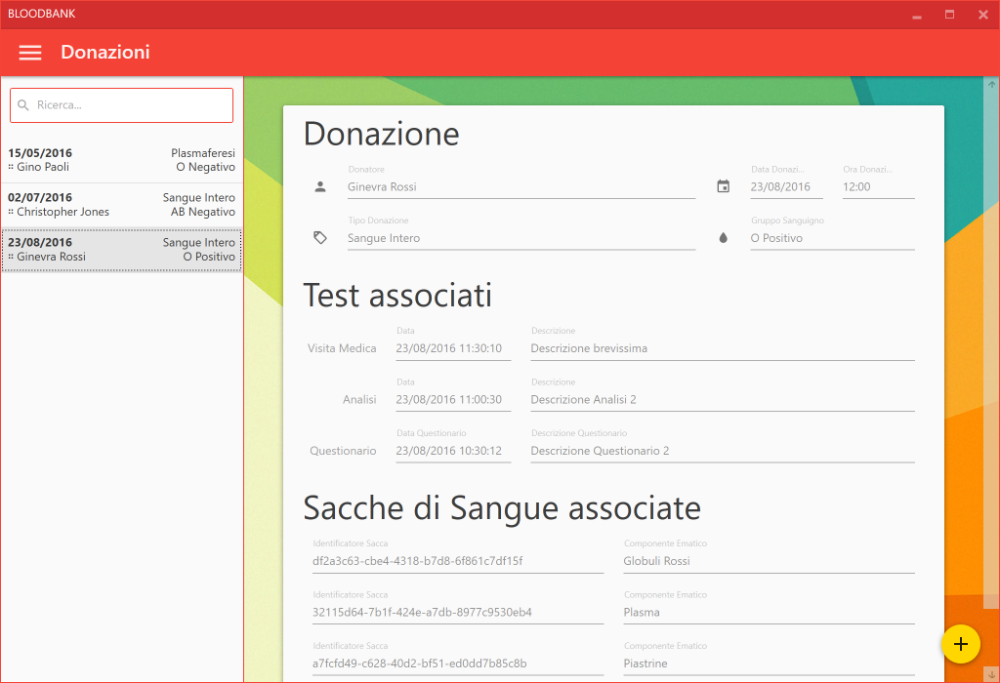
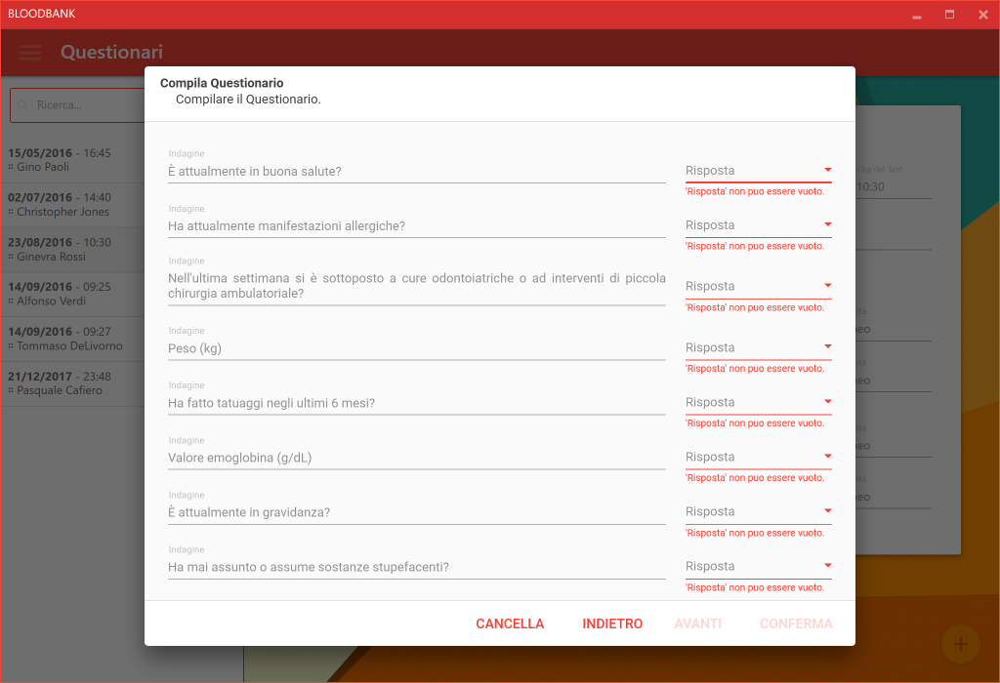
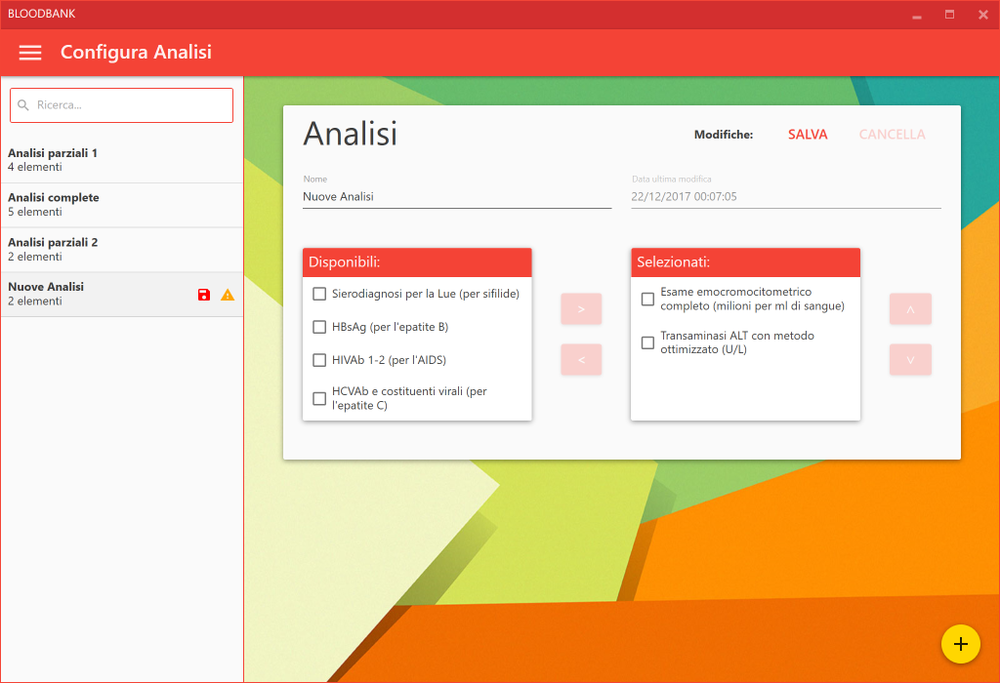
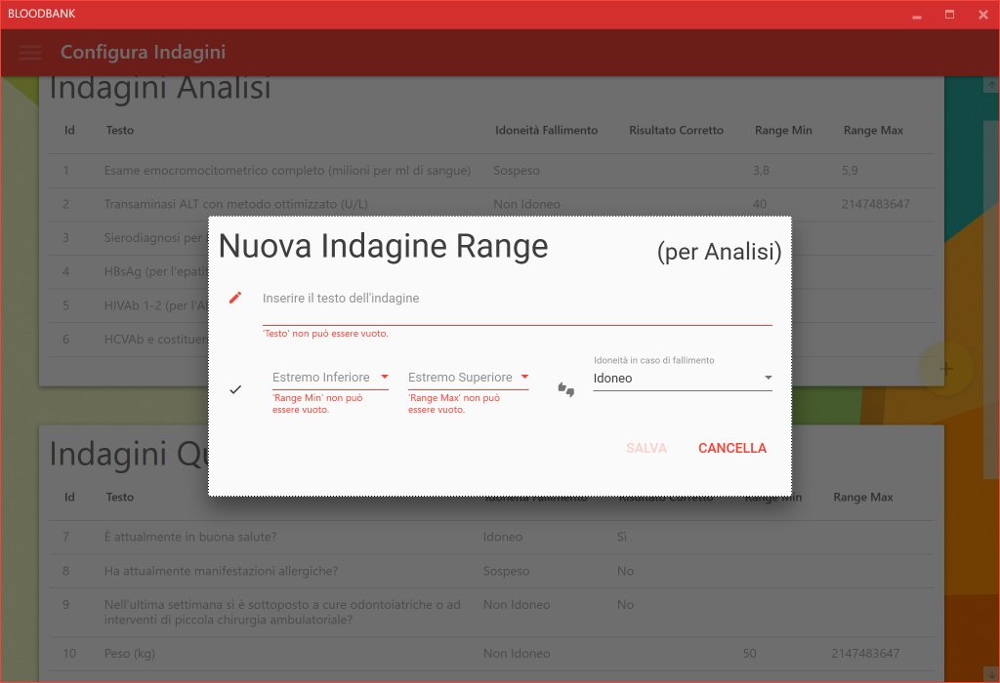

# BloodBank

Un progetto in **C# (.NET)** per la modellizzazione di un sistema informatico per il mantenimento e la gestione del servizio di donazioni di sangue per un centro trasfusionale. Il progetto è realizzato secondo il pattern architetturale **MVVM** con interfaccia grafica basata su **WPF**.

## Introduzione

Il progetto *BloodBank* modella una potenziale rappresentazione per una **banca dati di un centro trasfusionale**, in particolare per il sistema di gestione delle **donazioni di sangue**.

A tale scopo, il progetto permette di visualizzare tutti i donatori presenti nel servizio, registrare le donazioni effettuate e le corrispondenti sacche prelevate.

Inoltre il progetto permette di gestire i controlli a cui devono essere sottoposti i potenziali **donatori**: deve essere presente una copia informatizzata di ogni **questionario**, **analisi** e **referto medico** relativo ad ognuno di essi. Il progetto calcola automaticamente l’*idoneità* risultante da ogni controllo, in modo da individuare immediatamente i donatori che non possono più donare.
Il progetto permette di modificare i questionari, per adattarli in caso di cambiamento delle norme vigenti; nonché di specificare con granularità le analisi mediche che il donatore deve effettuare.

Infine, il progetto permette di visualizzare tutte le **sacche di componenti ematici** ottenute dalle donazioni, nonché di valutarne lo stato corrente. Se la sacca è ancora idonea, il progetto permette di prelevarla, registrando tale azione nel sistema.

Un'analisi più approfondita dei requisiti del sistema modellato dal progetto è disponibile [qui](https://github.com/francescospilla/unibo-inginf-bloodbank/raw/master/docs/documento-dei-requisiti.pdf).

## Screenshots

## Getting Started

Scaricare il codice sorgente da questo repository con `git clone https://github.com/francescospilla/unibo-inginf-bloodbank.git` e compilare `BloodBank.sln` con [Visual Studio 2017](https://www.visualstudio.com/) (o più recenti). In alternativa, sono disponibili i [binari](https://github.com/francescospilla/unibo-inginf-bloodbank/releases/tag/demo) già compilati.

Il progetto è *feature-complete* con l'eccezione della persistenza: all'avvio del software verranno inseriti dei dati simulati e sarà possibile manipolarli e inserirne di nuovi, tuttavia alla chiusura del programma tutte le modifiche saranno scartate.

##### Requisiti

È richiesto il **Framework .NET versione 4.6.1** (o superiore).

## Tecnologie utilizzate

Una lista **non-esaustiva** delle tecnologie utilizzate:

- [Stylet](https://github.com/canton7/Stylet), un leggero ma potente *framework MVVM* per WPF;
- [Ninject](https://github.com/ninject/Ninject), un veloce *dependency injector* per .NET;
- [FluentValidation](https://github.com/JeremySkinner/FluentValidation), una libreria per la *validazione* con interfaccia fluent per .NET;
- [Material Design in XAML Toolkit](https://github.com/ButchersBoy/MaterialDesignInXamlToolkit) e [Dragablz](https://github.com/ButchersBoy/Dragablz), due librerie XAML per la realizzazione dell'interfaccia grafica secondo le linee guida del *Material Design*.
